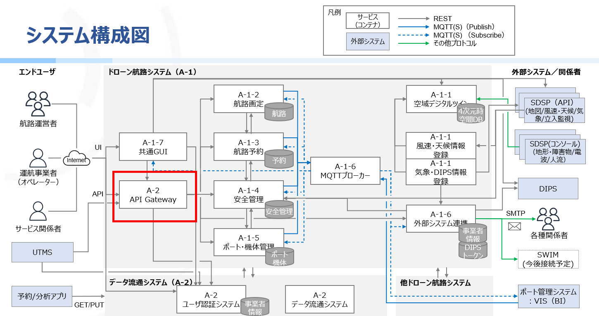

# ドローン航路システム API Gateway(nginx版)

## 概要
- ユーザ認証システムへの認証・認可およびクライアントからのリクエストを受け付け、適切なバックエンドサービスにルーティングする機能を提供する。

## ドローン航路システムにおける本機能の位置づけ

## 環境構築手順
- 環境構築手順については、以下のリンクを参照してください。

<a href="docs/APIGateway構築手順.md" target="_blank">docs/APIGateway構築手順.md </a>

## ライセンス
- 本リポジトリはMITライセンスで提供されています。
- ソースコードおよび関連ドキュメントの著作権は株式会社NTTデータに帰属します。
